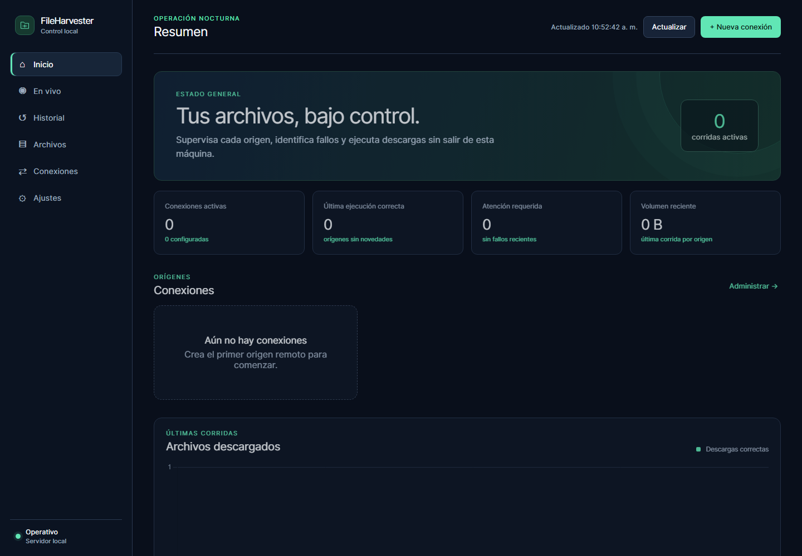
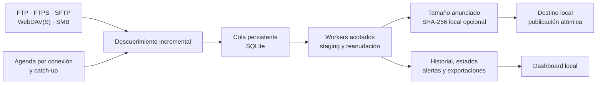

<div align="center">
  <h1>Recolecta</h1>
  <p><strong>Automatiza la recepción de archivos remotos, verifica cada transferencia y conserva evidencia de cada ejecución en Windows.</strong></p>

  <p>FTP · FTPS · SFTP · WebDAV(S) · SMB</p>

  <p>
    <a href="https://github.com/castellanosfelipe/Recolecta/releases/latest"></a>
    <a href="https://github.com/castellanosfelipe/Recolecta/actions/workflows/build-windows.yml"></a>
    
    <a href="LICENSE"></a>
  </p>

  <p>
    <a href="https://github.com/castellanosfelipe/Recolecta/releases/latest/download/Recolecta-Setup.exe"><strong>⬇️ Descargar instalador para Windows x64</strong></a>
    ·
    <a href="https://github.com/castellanosfelipe/Recolecta/releases/latest">Ver release, portable y hashes</a>
    ·
    <a href="docs/USER_GUIDE.md">Guía de usuario</a>
  </p>

  
</div>

## Por qué Recolecta

Los equipos operativos suelen depender de descargas manuales, scripts aislados
y revisiones posteriores para saber si un archivo llegó completo. Recolecta
convierte ese trabajo en un flujo programado, visible y recuperable:

- centraliza conexiones FTP, FTPS, SFTP, WebDAV(S) y SMB;
- valida credenciales, rutas remotas y escritura local antes de guardar;
- mantiene el árbol de carpetas con la plantilla predeterminada y nunca
  recodifica los documentos;
- programa cada conexión de forma independiente y recupera ventanas perdidas;
- registra progreso, archivos, errores y resultados con estados accionables;
- funciona localmente y el paquete instalado no necesita Python ni Internet.

Está pensada para operaciones, back office, datos e IT que necesitan mover
grandes inventarios de documentos sin perder control sobre lo recibido.

## Instala y activa tu primera conexión

### Requisitos

- Windows 10 u 11 Pro de 64 bits.
- Puerto local `8091` disponible, o uno alternativo indicado al instalar.
- Acceso de red a los servidores que se quieran consultar.

### Instalación en un comando

Descarga
[`Recolecta-Setup.exe`](https://github.com/castellanosfelipe/Recolecta/releases/latest/download/Recolecta-Setup.exe)
y ejecútalo desde PowerShell:

```powershell
.\Recolecta-Setup.exe
```

El Setup instala Recolecta en `%LOCALAPPDATA%\Recolecta`, registra su inicio
para el usuario actual y abre el dashboard en <http://127.0.0.1:8091>.

> [!IMPORTANT]
> El instalador todavía no está firmado digitalmente y Windows puede mostrar
> una advertencia de SmartScreen. Descárgalo solo desde este repositorio y
> verifica su SHA-256 antes de ejecutarlo.

Descarga también
[`SHA256SUMS.txt`](https://github.com/castellanosfelipe/Recolecta/releases/latest/download/SHA256SUMS.txt)
y exige una coincidencia antes de ejecutar el Setup:

```powershell
$expected = (Select-String -Path .\SHA256SUMS.txt -Pattern '\*Recolecta-Setup\.exe$').Line.Split(' ')[0]
$actual = (Get-FileHash .\Recolecta-Setup.exe -Algorithm SHA256).Hash.ToLowerInvariant()
if ($actual -ne $expected) { throw "El SHA-256 del instalador no coincide." }
"SHA-256 verificado: $actual"
```

### Primera conexión

1. Abre **Conexiones → Nueva conexión**.
2. Elige el protocolo y completa servidor, credencial, rutas remotas y destino
   local.
3. Define una hora diaria propia o conserva la agenda global.
4. Pulsa **Probar conexión y rutas**. Recolecta autentica, toma una muestra
   acotada de cada raíz remota y prueba crear, renombrar y eliminar un temporal
   local; esta validación no descarga ni recorre el árbol completo.
5. Guarda la conexión y usa **Simular corrida** para revisar qué se procesará.
6. Selecciona **Ejecutar ahora** o deja que trabaje la agenda.

Una conexión no puede guardarse ni activarse con rutas o credenciales sin
validar. Si cambias un dato de conectividad, deberás probarla otra vez.

## Capacidades clave

| Resultado | Cómo lo consigue |
|-----------|------------------|
| **Automatización independiente** | Hora diaria por conexión, zona horaria IANA, agenda global opcional y catch-up de ventanas perdidas. |
| **Transferencias seguras ante interrupciones** | Escribe en staging, reintenta fallos transitorios y solo reanuda con tamaño y fecha remotos confiables; de lo contrario reinicia sin mezclar versiones. Antes de publicar comprueba el tamaño anunciado y puede calcular y registrar el SHA-256 local. |
| **Estructura remota preservada** | Con la plantilla predeterminada `{remote_tree}`, reproduce la jerarquía lógica del origen, sanea nombres incompatibles con Windows y bloquea escapes del destino. No sigue symlinks. |
| **Comparación completa** | Compara existencia, tamaño y fecha, descarga ausentes o diferentes y conserva extras locales. No compara contenido byte a byte ni contra un hash remoto. |
| **Cola persistente y memoria acotada** | Descubre y persiste metadatos por lotes, consume una cola SQLite con trabajadores limitados y corta fallos sistémicos repetidos. El rendimiento depende del servidor y del disco local. |
| **Recursos bajo control** | Tope agregado e individual de ancho de banda, comprobación incremental de espacio y cancelación durante esperas o backoff. |
| **Contenido sin alteraciones** | Trata cada documento como bytes opacos: no lo decodifica, recodifica ni normaliza durante la descarga. |
| **Seguridad local** | Secretos protegidos con DPAPI, TLS verificado por defecto y credenciales excluidas de API, logs y exportaciones. |
| **Trazabilidad accionable** | Progreso, velocidad, ETA, historial por archivo, alertas, CSV, reportes HTML y bundle de soporte. |
| **Migración controlada** | Importa backups JSON de Recolecta o StabilityMonitor; cada conexión nace en pausa y las fuentes no compatibles, como SQL Server u Oracle, se informan sin abortar el resto. |
| **Distribución offline** | Setup autoextraíble y ZIP portable construidos con dependencias inventariadas y verificadas por SHA-256. |

## Estados que explican qué ocurrió

| Estado visible | Significado |
|----------------|-------------|
| **Archivos no existentes** | El servidor no contenía archivos aplicables; no se trata como fallo. |
| **Sin archivos nuevos** | Había elementos, pero ninguno necesitaba descargarse. |
| **Descarga completada** | Uno o más archivos se publicaron correctamente. |
| **Resultado parcial** | Parte del lote terminó y otra parte requiere atención. |
| **Fallida** | La ejecución no pudo completarse y muestra una causa específica, como autenticación, TLS, ruta, red o espacio. |

## Cómo funciona



La comparación completa es unidireccional: **remoto → local**. Ignora la
ventana y el historial para revisar todo el árbol mediante metadatos; puede
reparar archivos ausentes o diferentes, pero no elimina contenido local
adicional. En inventarios grandes, simula primero y confirma el espacio libre.

## Instalación portable y operación avanzada

<details>
<summary><strong>Usar el paquete portable</strong></summary>

Descarga
[`Recolecta-win64.zip`](https://github.com/castellanosfelipe/Recolecta/releases/latest/download/Recolecta-win64.zip),
extráelo en una carpeta permanente, entra en la carpeta `Recolecta` incluida
en el ZIP y ejecuta:

```powershell
Set-Location .\Recolecta
powershell -NoProfile -ExecutionPolicy Bypass -File .\install.ps1
```

</details>

<details>
<summary><strong>Ejecutar como SYSTEM al iniciar Windows</strong></summary>

Los modos usuario y `SYSTEM` no deben coexistir. Si vas a cambiar de modo,
ejecuta primero `uninstall.ps1` desde la instalación actual. Los secretos
cifrados para un usuario no migran al alcance de máquina: deberás ingresarlos
y validar de nuevo las conexiones.

Desde el paquete portable, abre PowerShell como administrador y ejecuta:

```powershell
powershell -NoProfile -ExecutionPolicy Bypass -File .\install-service.ps1
```

Este modo usa `%PROGRAMDATA%\Recolecta`, DPAPI de máquina y no muestra icono
de bandeja ni notificaciones de escritorio.

</details>

<details>
<summary><strong>Simular o ejecutar desde la terminal</strong></summary>

```powershell
# Simular una conexión sin descargar
& "$env:LOCALAPPDATA\Recolecta\Recolecta.exe" --run-now --connection 3 --dry-run

# Ejecutar una fecha concreta
& "$env:LOCALAPPDATA\Recolecta\Recolecta.exe" --run-now --connection 3 --date 2026-08-13
```

Estos comandos delegan en la API local y no deben usarse si activaste Basic
Auth para el dashboard; en ese caso ejecuta o simula desde la interfaz.

</details>

La [guía de usuario](docs/USER_GUIDE.md) cubre configuración, importación,
estados y solución de problemas. La [guía de operaciones](docs/OPERATIONS.md)
explica recuperación, rotación de credenciales, respaldos y soporte.

## Seguridad y alcance

- El dashboard escucha en `127.0.0.1` de forma predeterminada.
- FTPS explícito (`AUTH TLS`) y WebDAVS verifican certificado y nombre del host
  por defecto. WebDAVS no degrada a HTTP. El modo sin verificación debe
  reservarse para una LAN interna controlada; FTP y WebDAV no usan TLS.
- SFTP aplica TOFU: registra una clave nueva en el primer uso y rechaza cambios
  posteriores. SMB admite SMB2/3, exige firma y no admite SMB1; no fuerza el
  cifrado de sesión.
- Los secretos se cifran con DPAPI para el usuario o la máquina que ejecuta
  Recolecta; no se exportan junto con la configuración.
- Las acciones remotas destructivas no forman parte del flujo de descarga.

## Estado del proyecto

| Evidencia de v0.2.2 | Resultado |
|---------------------|-----------|
| Suite automatizada | 374 pruebas aprobadas; 1 omisión esperada por permisos de symlink en Windows. |
| Cobertura | 86,82 %, por encima de la compuerta obligatoria del 85 %. |
| Protocolos | FTP/FTPS, SFTP y WebDAV con smokes locales reales; SMB cubierto por pruebas del cliente, timeout, binarios y reanudación. |
| Paquete portable | Autodiagnóstico congelado, dashboard y recursos estáticos aprobados. |
| Instalador | Extracción aislada y autodiagnóstico aprobados sin alterar tareas durante el smoke. |
| Release | [`v0.2.2`](https://github.com/castellanosfelipe/Recolecta/releases/tag/v0.2.2), con Setup, ZIP, hashes y evidencias JSON. |

Pendientes conocidos: firma de código, validación posterior a reinicio en una
VM limpia y certificación SMB contra endpoints autenticados representativos.

## Construir desde el código fuente

En Windows x64, clona el repositorio y ejecuta:

```powershell
powershell -NoProfile -ExecutionPolicy Bypass -File .\build.ps1
```

El script trabaja con el inventario offline, verifica hashes, ejecuta la suite
y su cobertura, congela la aplicación, crea el Setup y genera
`dist\Recolecta-win64.zip`, `dist\Recolecta-Setup.exe` y `SHA256SUMS.txt`.

Valida después ambos artefactos:

```powershell
powershell -NoProfile -ExecutionPolicy Bypass -File .\scripts\acceptance_smoke.ps1
powershell -NoProfile -ExecutionPolicy Bypass -File .\scripts\installer_smoke.ps1
```

Consulta también:

- [Especificación funcional y técnica](docs/SPEC.md)
- [Criterios de aceptación](docs/ACCEPTANCE.md)
- [Decisiones de arquitectura](docs/DECISIONS.md)
- [Guía de operaciones](docs/OPERATIONS.md)

## Contribuir

Las contribuciones son bienvenidas. Abre primero un
[issue](https://github.com/castellanosfelipe/Recolecta/issues) con un caso
reproducible o el resultado esperado; después envía una rama enfocada con sus
pruebas. `build.ps1` debe terminar correctamente antes del pull request.

## Licencia

Distribuido bajo la [licencia MIT](LICENSE).

---

<div align="center">
  <p>Creado por <a href="https://github.com/castellanosfelipe">castellanosfelipe</a></p>
  <p>
    <a href="https://github.com/castellanosfelipe/Recolecta">GitHub</a>
    ·
    <a href="https://www.linkedin.com/in/bairon-felipe-pe%C3%B1a-castellanos-ab18411b5">LinkedIn</a>
  </p>
</div>
