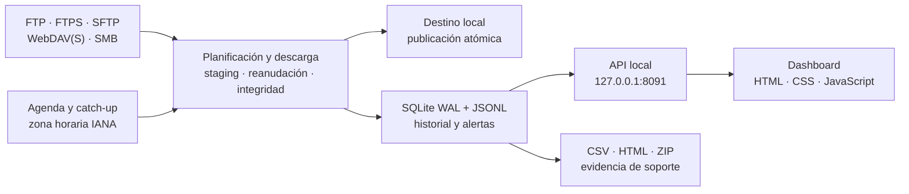

<div align="center">
  <h1>Recolecta</h1>
  <p><strong>Automatiza la recepción de archivos remotos, verifica cada entrega y conserva una trazabilidad completa desde Windows.</strong></p>

  

  <p>
    
    
    
    
    
    
  </p>

  <p>
    <a href="https://github.com/castellanosfelipe/Recolecta/releases/latest"><strong>Descargar la última versión</strong></a>
    ·
    <a href="docs/USER_GUIDE.md">Guía de usuario</a>
    ·
    <a href="docs/OPERATIONS.md">Guía de operaciones</a>
  </p>
</div>

## 📋 Tabla de Contenidos

- [¿Qué es Recolecta?](#-qué-es-recolecta)
- [Demo en vivo](#-demo-en-vivo)
- [Características principales](#-características-principales)
- [Capturas de pantalla](#-capturas-de-pantalla)
- [Instalación rápida](#-instalación-rápida)
- [Cómo usar](#-cómo-usar)
- [Arquitectura](#️-arquitectura)
- [Roadmap](#️-roadmap)
- [Contribuir](#-contribuir)
- [Licencia](#-licencia)

## 🎯 ¿Qué es Recolecta?

Recolecta es una aplicación local para Windows que reúne automáticamente
archivos provenientes de FTP, FTPS, SFTP, WebDAV(S) y SMB. Sustituye tareas
manuales y scripts dispersos por un proceso programado, verificable y visible
desde un dashboard, incluso en equipos sin acceso a internet.

### El problema que resuelve

Los equipos operativos suelen depender de descargas repetitivas, credenciales
distribuidas y revisiones manuales para saber si un archivo llegó completo.
Cuando algo falla, reconstruir qué ocurrió consume tiempo y retrasa procesos
posteriores.

### La solución

Recolecta programa cada origen, reanuda transferencias interrumpidas, valida
la integridad antes de publicar un archivo y registra cada resultado. Así, el
equipo puede detectar excepciones y actuar sobre ellas sin supervisar
constantemente cada servidor.

### ¿Para quién es?

| Audiencia | Beneficio clave |
|-----------|-----------------|
| **Operaciones y back office** | Recibe archivos recurrentes sin ejecutar descargas manuales y ve rápidamente qué requiere atención. |
| **Equipos de datos e IT** | Centraliza conexiones heterogéneas con integridad, reintentos, límites de carga y trazabilidad técnica. |
| **Responsables de producto y soporte** | Obtiene evidencia operativa, reportes exportables y señales claras para medir confiabilidad y resolver incidentes. |

## 🎬 Demo en vivo

<!-- TODO: agregar demo.gif del flujo principal: crear una conexión, ejecutar una prueba y observar la descarga en vivo -->

El repositorio todavía no incluye un video o GIF verificable. La
[captura del dashboard](#-capturas-de-pantalla) muestra la experiencia actual,
y la aplicación completa puede probarse desde la
[última release](https://github.com/castellanosfelipe/Recolecta/releases/latest).

## ✨ Características principales

| Feature | Descripción |
|---------|-------------|
| 🔌 **Conexiones multiprotocolo** | Reúne archivos desde FTP, FTPS, SFTP, WebDAV, WebDAVS y SMB sin cambiar de herramienta. |
| 🗓️ **Automatización con recuperación** | Permite una hora distinta por conexión —o la hora global— y recupera ventanas perdidas mediante catch-up sin duplicar entregas correctas. |
| 🔄 **Migración controlada** | Importa backups JSON de StabilityMonitor como borradores en pausa, protege las credenciales incluidas e informa protocolos SQL/Oracle omitidos sin abortar el resto. |
| ✅ **Transferencias confiables** | Usa staging, reanudación, reintentos y validación por tamaño o SHA-256 antes de publicar cada archivo. |
| 🌳 **Árbol remoto preservado** | Replica bajo el destino local la misma jerarquía de carpetas del origen, con reservas estables ante colisiones de nombres en Windows. |
| 🔎 **Comparación completa por conexión** | Detecta y descarga archivos locales ausentes o diferentes sin borrar archivos extra; puede activarse de forma independiente para cada origen. |
| 🧱 **Escala para millones** | Descubre, persiste y consume una cola por lotes acotados, con trabajadores limitados y un cortacircuitos ante fallos sistémicos consecutivos, sin cargar el inventario completo en memoria. |
| 🧬 **Bytes opacos de extremo a extremo** | No decodifica, recodifica ni normaliza documentos: conserva exactamente los bytes recibidos durante staging, reanudación y publicación. |
| 🔐 **Credenciales protegidas** | Almacena secretos mediante DPAPI de usuario o de máquina y evita exponerlos en API, logs y exportaciones. |
| 📊 **Control y trazabilidad local** | Presenta progreso, velocidad, ETA, historial, alertas y archivos procesados desde un dashboard sin recursos externos. |
| 📦 **Operación realmente offline** | Ofrece instalador autoextraíble, paquete portable y build reproducible con dependencias verificadas por SHA-256. |

## 📸 Capturas de pantalla

### Dashboard operativo

<div align="center">
  
  <p><em>El resumen concentra estado, actividad reciente y excepciones para que el usuario sepa dónde actuar sin revisar logs manualmente.</em></p>
</div>

## 🚀 Instalación rápida

### Prerrequisitos

- Windows 10 u 11 de 64 bits.
- Puerto local `8091` disponible.
- No se requiere Python ni conexión a internet en el equipo destino.

### Pasos

1. Descarga `Recolecta-Setup.exe` y `SHA256SUMS.txt` desde la
   [última release](https://github.com/castellanosfelipe/Recolecta/releases/latest).
2. Verifica el instalador:

```powershell
Get-FileHash .\Recolecta-Setup.exe -Algorithm SHA256
Get-Content .\SHA256SUMS.txt
```

3. Ejecuta el Setup:

```powershell
.\Recolecta-Setup.exe
```

El instalador copia la aplicación en `%LOCALAPPDATA%\Recolecta`, registra su
inicio para el usuario actual, conserva los datos durante actualizaciones y
abre `http://127.0.0.1:8091`.

✅ Si todo está correcto, verás la confirmación **“Recolecta quedó instalada”**
y el dashboard se abrirá en el navegador.

<details>
<summary><strong>Alternativa portable</strong></summary>

Descarga `Recolecta-win64.zip`, verifica su hash, extráelo en una carpeta
permanente y ejecuta:

```powershell
Set-ExecutionPolicy -Scope Process Bypass
.\install.ps1
```

</details>

## 💡 Cómo usar

### Caso de uso básico

1. Abre `http://127.0.0.1:8091`.
2. Selecciona **Conexiones → Nueva conexión**.
3. Define protocolo, servidor, credencial, rutas remotas, destino local y,
   si lo necesitas, una hora diaria propia para esa conexión.
4. Pulsa **Probar conexión y rutas** para validar credencial, orígenes remotos
   y escritura en el destino local.
5. Guarda la conexión y usa **Ejecutar ahora** o deja que la agenda trabaje.

El dashboard mostrará progreso, resultado e historial de cada archivo.

También puedes usar **Conexiones → Importar JSON** con un
`monitor-backup.json` de StabilityMonitor. Recolecta importa FTP, FTPS, SFTP,
WebDAV(S) y SMB; las fuentes SQL/Oracle se informan como omitidas. Todas las
conexiones importadas quedan en pausa hasta probar sus credenciales y rutas;
si alguna no trae secreto, debes ingresarlo antes de activarla.

### Casos de uso avanzados

#### Validar una conexión sin descargar

```powershell
& "$env:LOCALAPPDATA\Recolecta\Recolecta.exe" `
  --run-now `
  --connection 3 `
  --dry-run
```

#### Recuperar una fecha específica

```powershell
& "$env:LOCALAPPDATA\Recolecta\Recolecta.exe" `
  --run-now `
  --connection 3 `
  --date 2026-07-26
```

#### Operar sin una sesión iniciada

Desde el paquete portable, abre PowerShell como administrador y ejecuta:

```powershell
.\install-service.ps1
```

Este modo registra `Recolecta-Service` como `SYSTEM`, utiliza DPAPI de máquina
y mantiene el dashboard local sin mostrar bandeja ni notificaciones de
escritorio.

## 🏗️ Arquitectura



### Stack tecnológico

| Capa | Tecnología | Propósito |
|------|------------|-----------|
| **Experiencia local** | HTML, CSS, JavaScript y Chart.js | Dashboard responsivo, progreso en vivo y visualización sin CDN. |
| **API y proceso residente** | Python 3.12, FastAPI y Uvicorn | Orquesta la aplicación y expone operaciones únicamente en la máquina local por defecto. |
| **Agenda** | APScheduler, tzlocal y tzdata | Ejecuta ventanas por zona horaria, catch-up y tareas de retención. |
| **Transferencias** | Paramiko, HTTPX y adaptadores FTP/FTPS/SMB | Unifica conexión, listado, reanudación y descarga para cada protocolo. |
| **Persistencia y auditoría** | SQLite WAL y logs JSONL | Conserva configuración, corridas, archivos, alertas y evidencia operativa. |
| **Seguridad Windows** | DPAPI, pywin32 y Basic Auth opcional | Protege credenciales y permite operación interactiva o como `SYSTEM`. |
| **Distribución** | PyInstaller, PowerShell y GitHub Actions | Produce Setup y ZIP offline con hashes y smoke tests reproducibles. |

## 🗺️ Roadmap

### ✅ Completado

- [x] Descarga y validación mediante FTP, FTPS, SFTP, WebDAV(S) y SMB.
- [x] Agenda independiente por conexión y zona horaria, catch-up, reintentos y control de duplicados.
- [x] Importación idempotente de conexiones desde StabilityMonitor con reporte de omisiones.
- [x] Dashboard local, alertas, exportaciones y bundle de soporte.
- [x] Instalador offline y paquete portable publicados en GitHub Releases.
- [x] Suite de 308 pruebas con compuerta de cobertura mínima del 85 %.

### 🔄 En progreso

- [ ] Validación de instalación, reinicio y recuperación en una VM Windows limpia sin internet ni Python.
- [ ] Evidencia separada de los modos usuario y `SYSTEM` después de reiniciar Windows.

### 🔮 Próximamente

- [ ] Firma de código para el instalador y los ejecutables de release.
- [ ] Pruebas de integración ampliadas contra servidores reales SFTP, SMB y WebDAV.
- [ ] Demo GIF del recorrido crear conexión → probar → descargar → auditar.

## 🤝 Contribuir

Las contribuciones son bienvenidas, especialmente cuando incluyen un caso de
uso reproducible y pruebas. Antes de abrir un pull request:

1. Crea un issue en
   [GitHub Issues](https://github.com/castellanosfelipe/Recolecta/issues)
   para describir el problema o resultado esperado.
2. Trabaja en una rama enfocada y evita mezclar cambios no relacionados.
3. Ejecuta la validación offline:

```powershell
Set-ExecutionPolicy -Scope Process Bypass
.\build.ps1
```

4. Confirma que las pruebas, la cobertura, el autodiagnóstico congelado y
   ambos smoke tests estén en verde.

La especificación, decisiones y criterios verificables están en
[`docs/`](docs/).

## 📄 Licencia

**MIT License** — consulta [`LICENSE`](./LICENSE) para más detalles.

---

<div align="center">
  <p>
    Hecho con ❤️ por
    <a href="https://github.com/castellanosfelipe">castellanosfelipe</a>
  </p>
  <p>
    <a href="https://github.com/castellanosfelipe/Recolecta">GitHub</a>
    ·
    <a href="https://www.linkedin.com/in/bairon-felipe-peña-castellanos-ab18411b5">LinkedIn</a>
  </p>
</div>
