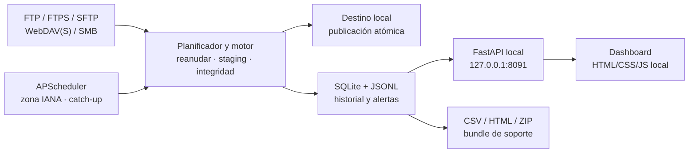

# Recolecta

Recolecta descarga de forma programada y auditable archivos desde FTP,
FTPS, SFTP, WebDAV(S) y SMB. Está diseñado para Windows 10/11 x64, funciona
sin internet y ofrece un dashboard local sin recursos externos.


## Instalación rápida

El paquete `Recolecta-win64.zip` ya contiene Python y todas las
dependencias. No instale Python en el equipo destino.

1. Extraiga el ZIP en una carpeta permanente y escribible, por ejemplo
   `C:\Recolecta` o `%LOCALAPPDATA%\Recolecta`.
2. Abra PowerShell dentro de `Recolecta`.
3. Instale para el usuario actual:

```powershell
Set-ExecutionPolicy -Scope Process Bypass
.\install.ps1
```

4. Abra `http://127.0.0.1:8091`.

Para ejecución sin sesión, abra PowerShell **como administrador** y use
`.\install-service.ps1`. Este modo ejecuta como `SYSTEM`, no muestra bandeja
ni toasts y protege secretos con DPAPI de máquina. `.\uninstall.ps1` elimina
las tareas y detiene el proceso, pero conserva configuración, logs, exports y
archivos descargados.

Consulte [la guía de usuario](docs/USER_GUIDE.md) para el recorrido completo.

## Arquitectura



Cada transferencia escribe en `<destino>\.staging\<uuid>.part`, valida
tamaño o SHA-256 y publica con `os.replace`. Las credenciales nunca se
guardan en texto claro: DPAPI de usuario en modo interactivo y DPAPI de
máquina en modo `SYSTEM`.

## Construcción reproducible

El repositorio incluye:

- `vendor\python-3.12.10-amd64.exe`, bootstrap oficial de CPython;
- `wheelhouse\`, inventario versionado de wheels para CPython 3.12 x64;
- manifiestos `SHA256SUMS.txt`;
- `build.ps1`, que valida hashes, crea `.venv-build`, instala con
  `pip --no-index`, exige cobertura de `app/` ≥85 %, ejecuta las pruebas,
  congela con PyInstaller y prueba el ejecutable antes de crear el ZIP.
- `scripts\acceptance_smoke.ps1`, que extrae el ZIP, verifica su hash, arranca
  únicamente el `.exe` y exige dashboard operativo en menos de cinco segundos.

```powershell
Set-ExecutionPolicy -Scope Process Bypass
.\build.ps1
```

Salida:

- `dist\Recolecta\`
- `dist\Recolecta-win64.zip`
- `dist\SHA256SUMS.txt`

El pipeline de GitHub Actions repite el mismo build en Windows. Los tags con
forma `v*.*.*` publican el ZIP y su hash en una Release.

## Desarrollo

Requiere CPython.org 3.12 x64.

```powershell
py -3.12 -m venv .venv
.\.venv\Scripts\python.exe -m pip install -r requirements-dev.txt
.\.venv\Scripts\python.exe -m pytest
.\.venv\Scripts\python.exe launcher.py --self-test
```

El CLI también permite corridas manuales:

```powershell
Recolecta.exe --run-now
Recolecta.exe --run-now --connection 3 --dry-run
Recolecta.exe --run-now --connection 3 --date 2026-07-26
```

## Documentación

- `docs/SPEC.md`: especificación completa.
- `docs/DECISIONS.md`: decisiones de arquitectura.
- `docs/ACCEPTANCE.md`: criterios de aceptación.
- `docs/USER_GUIDE.md`: instalación, configuración y solución de problemas.
- `docs/OPERATIONS.md`: runbook de soporte y recuperación.
